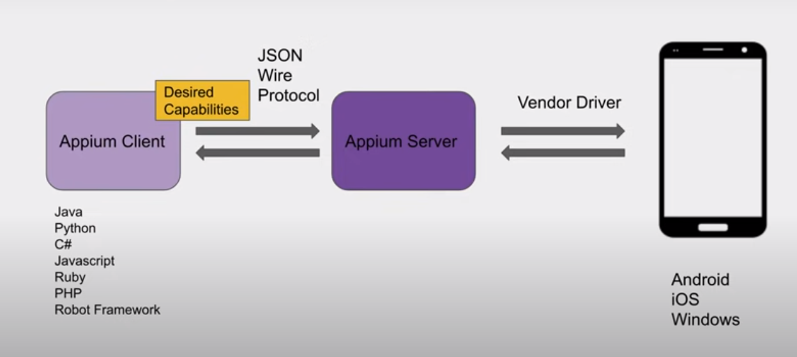
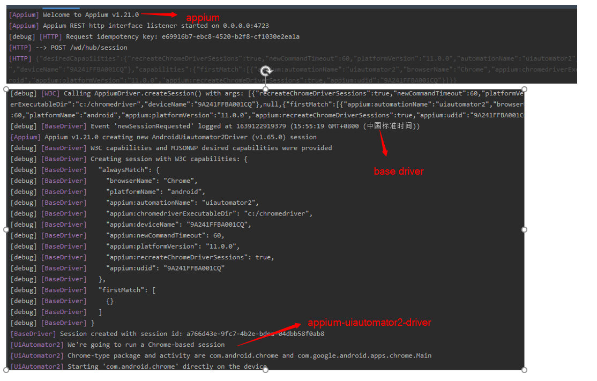

# Appium Study
Use this repo to play with appium related components

### How Appium works？
+ Appium works as client-server architecture
+ Appium is a "http server" written using Node.js platform

  

+ Appium Desired Capabilities

  __Desired Capabilities__ are keys and values encoded in a JSON object, sent by Appium clients to the server when a new automation session is requested. They tell the Appium drivers all kinds of important things about how you want your test to work. Each Appium client builds capabilities in a way specific to the client's language, but at the end of the day, they are sent over to Appium as JSON objects.

### Install Appium
### Install with node.js
+ check node.js and npm installed
```shell script
node --version
npm --version
```
+ If not, download node.js and install node.js & npm
  
  [Download node js](https://nodejs.org/en/download/)
  
+ Install appium with node js
```shell script
npm install -g appium
```

+ check appium installed
```shell script
appium --version
```

+ Start appium
```shell script
appium
```

### Appium Test Framework
TestNG + Appium + Gradle

#### Init Gradle project
```shell script
$ gradle init
```
```shell script
Select type of project to generate:
  1: basic
  2: application
  3: library
  4: Gradle plugin
Enter selection (default: basic) [1..4] 2

Select implementation language:
  1: C++
  2: Groovy
  3: Java
  4: Kotlin
  5: Scala
  6: Swift
Enter selection (default: Java) [1..6] 3

Select build script DSL:
  1: Groovy
  2: Kotlin
Enter selection (default: Groovy) [1..2] 1

Select test framework:
  1: JUnit 4
  2: TestNG
  3: Spock
  4: JUnit Jupiter
Enter selection (default: JUnit 4) [1..4]

Project name (default: demo):
Source package (default: demo):com.liangz.appiumstudy
```

#### Add dependencies: java-client & testng
```groovy
repositories {
  // Use Maven Central for resolving dependencies.
  mavenCentral()
}

dependencies {
  // Use TestNG framework, also requires calling test.useTestNG() below
  implementation 'org.testng:testng:7.3.0'

  // This dependency is used by the application.
  implementation 'com.google.guava:guava:30.0-jre'
  implementation group: 'io.appium', name: 'java-client', version: '7.6.0'
}
```

#### Start Appium Server
```shell
> appium
[Appium] Welcome to Appium v1.21.0
[Appium] Appium REST http interface listener started on 0.0.0.0:4723
```

#### Create BaseTest Class to initialize Appium Driver with URL and Desired Capabilities
```java
import org.openqa.selenium.WebElement;
import org.openqa.selenium.remote.DesiredCapabilities;
import org.testng.annotations.BeforeTest;

import java.net.URL;

import io.appium.java_client.AppiumDriver;
import io.appium.java_client.remote.MobileCapabilityType;

public class BaseTest {
  public AppiumDriver<WebElement> driver;

  @BeforeTest
  public void setup() {
    try {
      DesiredCapabilities desiredCapabilities = new DesiredCapabilities();
      desiredCapabilities.setCapability(MobileCapabilityType.PLATFORM_NAME, "ANDROID");
      desiredCapabilities.setCapability(MobileCapabilityType.PLATFORM_VERSION, "11.0.0");
      desiredCapabilities.setCapability(MobileCapabilityType.DEVICE_NAME, "9A241FFBA001CQ");
      desiredCapabilities.setCapability(MobileCapabilityType.UDID, "9A241FFBA001CQ");
      desiredCapabilities.setCapability(MobileCapabilityType.NEW_COMMAND_TIMEOUT, 60);
      desiredCapabilities.setCapability(MobileCapabilityType.BROWSER_NAME, "Chrome");
      desiredCapabilities.setCapability("chromedriverExecutableDir", "c:/chromedriver");
      desiredCapabilities.setCapability("recreateChromeDriverSessions", true);
      desiredCapabilities.setCapability(MobileCapabilityType.AUTOMATION_NAME, "uiautomator2");

      URL url = new URL("http://0.0.0.0:4723/wd/hub");
      driver = new AppiumDriver<>(url, desiredCapabilities);
    } catch (Exception ex) {
      ex.printStackTrace();
    }
  }
}
```

### Appium Server Components
 
#### appium
 https://github.com/appium/appium (main.js)
#### appium-base-driver 
https://github.com/appium/appium-base-driver

This is the parent class that all appium drivers inherit from, along with a collection of globally-used Appium driver utilities.
#### appium-android-driver
 https://github.com/appium/appium-android-driver
 
should not be used to automate devices running Android version 6.0 (codename Marshmallow, API level 23) or greater
#### appium-uiautomator2-driver (New)
 https://github.com/appium/appium-uiautomator2-driver
    
  ```text
    Install io.appium.uiautomator2.server and io.appium.uiautomator2.server.test to device
     https://github.com/appium/appium-uiautomator2-driver/blob/7c42e9fb761eb8de788e19f3b5fa448a16dcba2a/lib/uiautomator2.js#L98
  ``` 

#### appium-uiautomator2-server 
https://github.com/appium/appium-uiautomator2-server

Install on device. A netty server that runs on the device listening for commands and executes using UiAutomator V2.
#### .... Other drivers

### Setup the Android device
#### Google's UIAutomator2 technology  
UI Automator is a UI testing framework suitable for cross-app functional UI testing across system and installed apps.

The UI Automator testing framework provides a set of APIs to build UI tests that perform interactions on user apps and system apps. The UI Automator APIs allows you to perform operations such as opening the Settings menu or the app launcher in a test device. The UI Automator testing framework is well-suited for writing black box-style automated tests, where the test code does not rely on internal implementation details of the target app.

The key features of the UI Automator testing framework include the following:

+ A viewer to inspect layout hierarchy. For more information, see [UI Automator Viewer](https://developer.android.com/training/testing/ui-automator#ui-automator-viewer).
+ An API to retrieve state information and perform operations on the target device. For more information, see [Accessing device state](https://developer.android.com/training/testing/ui-automator#accessing-device-state).
+ APIs that support cross-app UI testing. For more information, see [UI Automator APIs](https://developer.android.com/training/testing/ui-automator#ui-automator-apis).


#### Appium UIAutomator2 server
Code repo: https://github.com/appium/appium-uiautomator2-server

A netty server that runs on the device listening for commands and executes using UiAutomator V2.

##### Build project
```shell script
gradle clean assembleServerDebug assembleServerDebugAndroidTest
```

##### Starting server
push both src and test apks to the device and execute the instrumentation tests.
```shell script
adb shell am instrument -w io.appium.uiautomator2.server.test/androidx.test.runner.AndroidJUnitRunner
```

Then install the apk to Android device.
