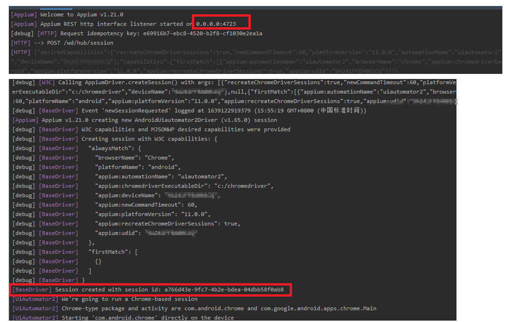

# Appium Study
Use this repo to play with appium related components

### How Appium works？
+ Appium works as client-server architecture
+ Appium is a "http server" written using Node.js platform

  

+ Appium Desired Capabilities

  __Desired Capabilities__ are keys and values encoded in a JSON object, sent by Appium clients to the server when a new automation session is requested. They tell the Appium drivers all kinds of important things about how you want your test to work. Each Appium client builds capabilities in a way specific to the client's language, but at the end of the day, they are sent over to Appium as JSON objects.

### Install Appium
### Install with node.js
+ check node.js and npm installed
```shell script
node --version
npm --version
```
+ If not, download node.js and install node.js & npm
  
  [Download node js](https://nodejs.org/en/download/)
  
+ Install appium with node js
```shell script
npm install -g appium
```

+ check appium installed
```shell script
appium --version
```

+ Start appium
```shell script
appium
```

### Appium Test Framework
TestNG + Appium + Gradle

#### Init Gradle project
```shell script
$ gradle init
```
```shell script
Select type of project to generate:
  1: basic
  2: application
  3: library
  4: Gradle plugin
Enter selection (default: basic) [1..4] 2

Select implementation language:
  1: C++
  2: Groovy
  3: Java
  4: Kotlin
  5: Scala
  6: Swift
Enter selection (default: Java) [1..6] 3

Select build script DSL:
  1: Groovy
  2: Kotlin
Enter selection (default: Groovy) [1..2] 1

Select test framework:
  1: JUnit 4
  2: TestNG
  3: Spock
  4: JUnit Jupiter
Enter selection (default: JUnit 4) [1..4]

Project name (default: demo):
Source package (default: demo):com.liangz.appiumstudy
```

#### Add dependencies: java-client & testng
```groovy
repositories {
  // Use Maven Central for resolving dependencies.
  mavenCentral()
}

dependencies {
  // Use TestNG framework, also requires calling test.useTestNG() below
  implementation 'org.testng:testng:7.3.0'

  // This dependency is used by the application.
  implementation 'com.google.guava:guava:30.0-jre'
  implementation group: 'io.appium', name: 'java-client', version: '7.6.0'
}
```

#### Start Appium Server
```shell
> appium
[Appium] Welcome to Appium v1.21.0
[Appium] Appium REST http interface listener started on 0.0.0.0:4723
```

#### Create BaseTest Class to initialize Appium Driver with URL and Desired Capabilities
```java
import org.openqa.selenium.WebElement;
import org.openqa.selenium.remote.DesiredCapabilities;
import org.testng.annotations.BeforeTest;

import java.net.URL;

import io.appium.java_client.AppiumDriver;
import io.appium.java_client.remote.MobileCapabilityType;

public class BaseTest {
  public AppiumDriver<WebElement> driver;

  @BeforeTest
  public void setup() {
    try {
      DesiredCapabilities desiredCapabilities = new DesiredCapabilities();
      desiredCapabilities.setCapability(MobileCapabilityType.PLATFORM_NAME, "ANDROID");
      desiredCapabilities.setCapability(MobileCapabilityType.PLATFORM_VERSION, "11.0.0");
      desiredCapabilities.setCapability(MobileCapabilityType.DEVICE_NAME, "yourDeviceName");
      desiredCapabilities.setCapability(MobileCapabilityType.UDID, "yourDeviceId");
      desiredCapabilities.setCapability(MobileCapabilityType.NEW_COMMAND_TIMEOUT, 60);
      desiredCapabilities.setCapability(MobileCapabilityType.BROWSER_NAME, "Chrome");
      desiredCapabilities.setCapability("chromedriverExecutableDir", "c:/chromedriver");
      desiredCapabilities.setCapability("recreateChromeDriverSessions", true);
      desiredCapabilities.setCapability(MobileCapabilityType.AUTOMATION_NAME, "uiautomator2");

      URL url = new URL("http://0.0.0.0:4723/wd/hub");
      driver = new AppiumDriver<>(url, desiredCapabilities);
    } catch (Exception ex) {
      ex.printStackTrace();
    }
  }
}
```

### Appium Server Components
#### appium 
https://github.com/appium/appium (main.js)
+ Create and start appium service, create driver with desired capabilities.
 
 
#### appium-base-driver 
https://github.com/appium/appium-base-driver

This is the parent class that all appium drivers inherit from, along with a collection of globally-used Appium driver utilities.
#### appium-android-driver
 https://github.com/appium/appium-android-driver
 
should not be used to automate devices running Android version 6.0 (codename Marshmallow, API level 23) or greater

 
#### appium-uiautomator2-driver (New)
 https://github.com/appium/appium-uiautomator2-driver
    
  ```text
    Install io.appium.uiautomator2.server and io.appium.uiautomator2.server.test to device
     https://github.com/appium/appium-uiautomator2-driver/blob/7c42e9fb761eb8de788e19f3b5fa448a16dcba2a/lib/uiautomator2.js#L98
  ``` 

#### appium-uiautomator2-server 
https://github.com/appium/appium-uiautomator2-server

Install on device. A netty server that runs on the device listening for commands and executes using UiAutomator V2.
```text
2021-12-10 18:00:21.614 18097-18120/io.appium.uiautomator2.server D/TestExecutor: Adding listener androidx.test.internal.runner.listener.LogRunListener
2021-12-10 18:00:21.614 18097-18120/io.appium.uiautomator2.server D/TestExecutor: Adding listener androidx.test.internal.runner.listener.InstrumentationResultPrinter
2021-12-10 18:00:21.614 18097-18120/io.appium.uiautomator2.server D/TestExecutor: Adding listener androidx.test.internal.runner.listener.ActivityFinisherRunListener
2021-12-10 18:00:21.615 18097-18120/io.appium.uiautomator2.server I/TestRunner: run started: 1 tests
2021-12-10 18:00:21.616 18097-18120/io.appium.uiautomator2.server I/TestRunner: started: startServer(io.appium.uiautomator2.server.test.AppiumUiAutomator2Server)
2021-12-10 18:00:21.619 18097-18120/io.appium.uiautomator2.server I/appium: [AppiumUiAutomator2Server] Starting Server
2021-12-10 18:00:22.620 18097-18120/io.appium.uiautomator2.server I/appium: Starting MJPEG Server
2021-12-10 18:00:22.639 18097-18120/io.appium.uiautomator2.server I/appium: MJPEG Server started
2021-12-10 18:00:22.656 18097-18120/io.appium.uiautomator2.server I/appium: AndroidServer created on port 6790
2021-12-10 18:00:22.656 18097-18120/io.appium.uiautomator2.server I/appium: io.appium.uiautomator2.server started:
2021-12-10 18:00:22.660 18097-18126/io.appium.uiautomator2.server I/appium: Started UiAutomator2 io.appium.uiautomator2.http io.appium.uiautomator2.server on port 6790
2021-12-10 18:00:22.662 18097-18125/io.appium.uiautomator2.server I/appium: ServerSocket created on port 7810
2021-12-10 18:00:22.692 18097-18129/io.appium.uiautomator2.server W/tomator2.serve: Accessing hidden method Lsun/misc/VM;->maxDirectMemory()J (greylist, reflection, allowed)
2021-12-10 18:00:22.699 18097-18129/io.appium.uiautomator2.server W/tomator2.serve: Accessing hidden field Lsun/nio/ch/SelectorImpl;->selectedKeys:Ljava/util/Set; (greylist, reflection, allowed)
2021-12-10 18:00:22.700 18097-18129/io.appium.uiautomator2.server W/tomator2.serve: Accessing hidden field Lsun/nio/ch/SelectorImpl;->publicSelectedKeys:Ljava/util/Set; (greylist, reflection, allowed)
2021-12-10 18:00:22.718 18097-18097/io.appium.uiautomator2.server W/Thread-5: type=1400 audit(0.0:27082): avc: denied { read } for name="somaxconn" dev="proc" ino=12116398 scontext=u:r:untrusted_app_27:s0:c172,c257,c512,c768 tcontext=u:object_r:proc_net:s0 tclass=file permissive=0 app=io.appium.uiautomator2.server
2021-12-10 18:00:23.235 18097-18132/io.appium.uiautomator2.server I/appium: channel read: GET /wd/hub/status
2021-12-10 18:00:23.235 18097-18132/io.appium.uiautomator2.server I/appium: Status command
2021-12-10 18:00:23.246 18097-18132/io.appium.uiautomator2.server I/appium: AppiumResponse: {"sessionId":"None","value":{"message":"UiAutomator2 Server is ready to accept commands","ready":true}}
2021-12-10 18:00:23.255 18097-18132/io.appium.uiautomator2.server I/appium: channel read: POST /wd/hub/session
2021-12-10 18:00:23.255 18097-18132/io.appium.uiautomator2.server I/appium: NewSession command
2021-12-10 18:00:23.262 18097-18132/io.appium.uiautomator2.server W/tomator2.serve: Accessing hidden field Landroid/app/UiAutomation;->mOnAccessibilityEventListener:Landroid/app/UiAutomation$OnAccessibilityEventListener; (greylist-max-o, reflection, allowed)
2021-12-10 18:00:23.263 18097-18132/io.appium.uiautomator2.server I/appium: Created the new session with id a97d36ad-7742-437c-912b-682159b7f0fc and capabilities {appPackage=com.android.chrome, networkConnectionEnabled=true, recreateChromeDriverSessions=true, warnings={}, databaseEnabled=false, deviceName=9A241FFBA001CQ, platform=LINUX, deviceUDID=9A241FFBA001CQ, appActivity=com.google.android.apps.chrome.Main, desired={browserName=Chrome, platformName=android, automationName=uiautomator2, chromedriverExecutableDir=c:/chromedriver, deviceName=9A241FFBA001CQ, newCommandTimeout=90.0, platformVersion=11.0.0, recreateChromeDriverSessions=true, udid=9A241FFBA001CQ}, newCommandTimeout=90.0, platformVersion=11.0.0, webStorageEnabled=false, locationContextEnabled=false, automationName=uiautomator2, takesScreenshot=true, browserName=Chrome, javascriptEnabled=true, platformName=android, udid=9A241FFBA001CQ, chromedriverExecutableDir=c:/chromedriver}
2021-12-10 18:00:23.266 18097-18132/io.appium.uiautomator2.server I/appium: AppiumResponse: {"sessionId":"a97d36ad-7742-437c-912b-682159b7f0fc","value":{"capabilities":{"firstMatch":[{"platform":"LINUX","webStorageEnabled":false,"takesScreenshot":true,"javascriptEnabled":true,"databaseEnabled":false,"networkConnectionEnabled":true,"locationContextEnabled":false,"warnings":{},"desired":{"br…
2021-12-10 18:00:23.288 18097-18132/io.appium.uiautomator2.server I/appium: channel read: GET /wd/hub/session/a97d36ad-7742-437c-912b-682159b7f0fc/appium/device/info
2021-12-10 18:00:23.289 18097-18132/io.appium.uiautomator2.server I/appium: GetDeviceInfo command
2021-12-10 18:00:23.292 18097-18132/io.appium.uiautomator2.server I/TetheringManager: registerTetheringEventCallback:io.appium.uiautomator2.server
2021-12-10 18:00:23.299 18097-18132/io.appium.uiautomator2.server W/tomator2.serve: Accessing hidden field Landroid/net/NetworkCapabilities;->mSignalStrength:I (greylist-max-p, reflection, allowed)
2021-12-10 18:00:23.299 18097-18132/io.appium.uiautomator2.server W/tomator2.serve: Accessing hidden field Landroid/net/NetworkCapabilities;->mSSID:Ljava/lang/String; (greylist-max-o, reflection, allowed)
2021-12-10 18:00:23.306 18097-18132/io.appium.uiautomator2.server I/appium: AppiumResponse: {"sessionId":"a97d36ad-7742-437c-912b-682159b7f0fc","value":{"androidId":"0dfaf1e76bfa5dce","apiVersion":"30","bluetooth":{"state":"ON"},"brand":"google","carrierName":"","displayDensity":560,"locale":"en_US","manufacturer":"Google","model":"Pixel 4 XL","networks":[{"capabilities":{"SSID":null,"link…
2021-12-10 18:00:25.333 18097-18132/io.appium.uiautomator2.server I/appium: channel read: GET /wd/hub/session/a97d36ad-7742-437c-912b-682159b7f0fc/appium/device/pixel_ratio
2021-12-10 18:00:25.334 18097-18132/io.appium.uiautomator2.server I/appium: GetDevicePixelRatio command
2021-12-10 18:00:25.335 18097-18132/io.appium.uiautomator2.server I/appium: AppiumResponse: {"sessionId":"a97d36ad-7742-437c-912b-682159b7f0fc","value":3.5}
2021-12-10 18:00:25.343 18097-18132/io.appium.uiautomator2.server I/appium: channel read: GET /wd/hub/session/a97d36ad-7742-437c-912b-682159b7f0fc/appium/device/system_bars
2021-12-10 18:00:25.343 18097-18132/io.appium.uiautomator2.server I/appium: GetSystemBars command
2021-12-10 18:00:25.345 18097-18132/io.appium.uiautomator2.server I/appium: AppiumResponse: {"sessionId":"a97d36ad-7742-437c-912b-682159b7f0fc","value":{"statusBar":98}}
2021-12-10 18:00:25.355 18097-18132/io.appium.uiautomator2.server I/appium: channel read: GET /wd/hub/session/a97d36ad-7742-437c-912b-682159b7f0fc/window/current/size
2021-12-10 18:00:25.355 18097-18132/io.appium.uiautomator2.server I/appium: GetDeviceSize command
2021-12-10 18:00:25.355 18097-18132/io.appium.uiautomator2.server I/appium: Get window size of the device
2021-12-10 18:00:25.357 18097-18132/io.appium.uiautomator2.server I/appium: AppiumResponse: {"sessionId":"a97d36ad-7742-437c-912b-682159b7f0fc","value":{"height":2872,"width":1440}}
2021-12-10 18:01:25.363 18097-18132/io.appium.uiautomator2.server I/appium: READER_IDLE: closing the channel
2021-12-10 18:03:07.149 18097-18713/io.appium.uiautomator2.server I/appium: channel read: DELETE /wd/hub/session/a97d36ad-7742-437c-912b-682159b7f0fc
2021-12-10 18:03:07.150 18097-18713/io.appium.uiautomator2.server I/appium: DeleteSession command
2021-12-10 18:03:07.172 18097-18713/io.appium.uiautomator2.server I/appium: Stopping uiautomator2 io.appium.uiautomator2.http io.appium.uiautomator2.server
2021-12-10 18:03:07.180 18097-18713/io.appium.uiautomator2.server I/appium: AppiumResponse: {"sessionId":"a97d36ad-7742-437c-912b-682159b7f0fc","value":null}
2021-12-10 18:03:07.720 18097-18120/io.appium.uiautomator2.server I/TestRunner: finished: startServer(io.appium.uiautomator2.server.test.AppiumUiAutomator2Server)
2021-12-10 18:03:07.727 18097-18120/io.appium.uiautomator2.server I/TestRunner: run finished: 1 tests, 0 failed, 0 ignored
2021-12-10 18:03:07.734 18097-18120/io.appium.uiautomator2.server I/MonitoringInstr: waitForActivitiesToComplete() took: 0ms
```
#### .... Other drivers

### Google's UIAutomator2 technology  
UI Automator is a UI testing framework suitable for cross-app functional UI testing across system and installed apps.

The UI Automator testing framework provides a set of APIs to build UI tests that perform interactions on user apps and system apps. The UI Automator APIs allows you to perform operations such as opening the Settings menu or the app launcher in a test device. The UI Automator testing framework is well-suited for writing black box-style automated tests, where the test code does not rely on internal implementation details of the target app.

The key features of the UI Automator testing framework include the following:

+ A viewer to inspect layout hierarchy. For more information, see [UI Automator Viewer](https://developer.android.com/training/testing/ui-automator#ui-automator-viewer).
+ An API to retrieve state information and perform operations on the target device. For more information, see [Accessing device state](https://developer.android.com/training/testing/ui-automator#accessing-device-state).
+ APIs that support cross-app UI testing. For more information, see [UI Automator APIs](https://developer.android.com/training/testing/ui-automator#ui-automator-apis).

